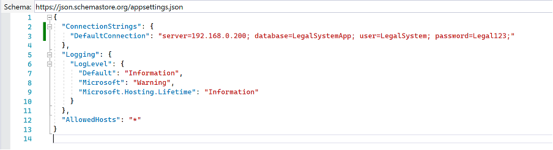
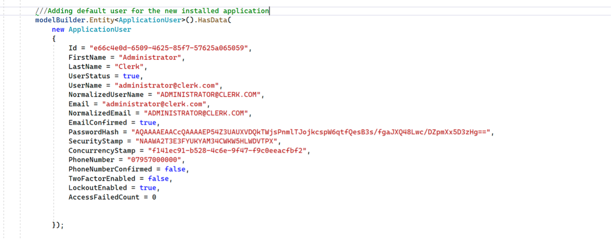
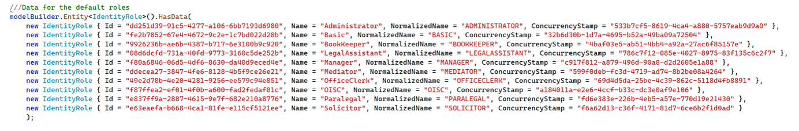

# Legal Manager Manual of Operation

## ACCESSING THE APPLICATION ONLINE

### 1. Accessing the application
-------------

+ a)	Open the Internet browser and go to: https://legalmanager.personalapps.online
+ b)	Login with one of the users presented in **part 2**

### 2. Pre-defined Users
-------------

| **Username** | **Password**	| **Role** |
| ---------|----------|----------|
| administrator@clerk.com | .A123a	| All roles |
| solicitor@clerk.com | .A123a	| Solicitor | 
| mediator@clerk.com | .A123a	| Mediator|
| immigration@clerk.com | .A123a	| Immigration Lawyer |
| paralegal@clerk.com | .A123a	| Paralegal |
| owner@clerk.com | .A123a	| Company’s Owner |
| bookkeeper@clerk.com | .A123a	| Bookkeeper |
| assistant@clerk.com | .A123a	| Legal Assistant |
| office@clerk.com | .A123a	| Office clerk |
| basic-user@clerk.com | .A123a	| no role |
| admin@clerk.com | .A123a	| Tester account with all roles|

### 3. Operating the Application
-------------

+ 1. **For Administrative functions:** Login into the system => Administration => listed options
+ 2. **For Legal Functions:** Login => Cases => list of options
+ 3. **For office related tasks:** Login => Calendar or Clients => listed options
+ 4. **For finance related activities:** Login => Finance => listed options
 
 -------------
 
 
# Installing the Application Locally

### 1. Configuring the Database Access

The application uses a `MySQL Server` database for persistence, and to be able to install the application locally you will need to have a machine with `MySQL` installed and running, and follow the instructions below:

+ a)	Create a new and empty database in the `MySQL server`
+ b)	Create a user with full access to the database
+ c)	Open the application settings file located at: ***../LegalSystem/LegalManager/LegalManager/appsettings.json (Figure 1)***
+ d)	Update the “DefaultConnection” section with your server location (localhost if it is in the local machine)
+ e)	Insert into the variable “server=” your server location
+ f)	Insert into the variable “database=” your database name
+ g)	Insert into the variable “user=” your database user’s name
+ h)	Insert into the variable “password=” your database user’s password
+ i)	Save and close the file.
+ j)	If you are using and `IDE` to build and run the application: Go to ***Package Management Console*** and insert the command -> **add-migration initialBuild**
+ k)	If you are using the command line interface `(CLI)`: Go to the application directory -> digit the command -> dotnet add migration migrationname
+ l)	Build and run your application

